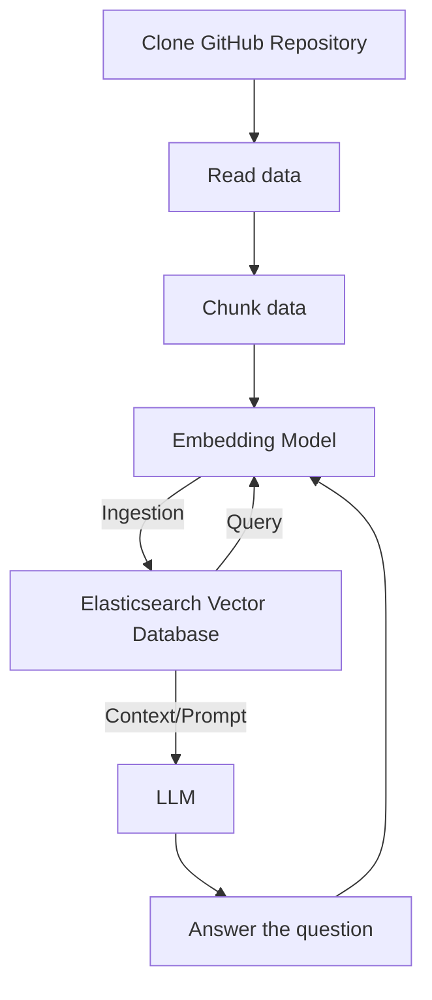

# github-repo-searcher
DoD: Развернуто локальное решение с простым frontend. Система должна позволять загрузить ссылку на GitHub-репозиторий, по которому в дальнейшем можно будет задавать вопросы по коду

