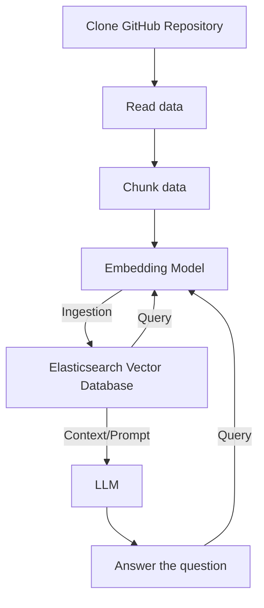

# github-repo-searcher
**DoD**: Развернуто локальное решение с простым frontend. Система должна позволять загрузить ссылку на GitHub-репозиторий, по которому в дальнейшем можно будет задавать вопросы по коду

### Схема работы


### Запусск и тестирование

#### Необходимые требования

Перед запуском скриптов убедитесь, что выполнены следующие условия:

1. **Python 3.8+**
2. **Необходимые библиотеки Python**: Установите их с помощью команды:
   ```bash
   pip install -r requirements.txt
   ```
3. **Elasticsearch**: Убедитесь, что Elasticsearch запущен на вашей системе. Настройки можно указать в файле `.env` (см. ниже).
4. **Git**: Для клонирования репозиториев GitHub.

#### Переменные окружения

Создайте файл `.env` в корневой директории со следующими переменными:

```env
ELASTIC_HOST=localhost
ELASTIC_PORT=9200
ELASTIC_INDEX=default_index
BASE_PATH=/tmp
```

- `ELASTIC_HOST`: Хост, на котором запущен Elasticsearch.
- `ELASTIC_PORT`: Порт для Elasticsearch.
- `ELASTIC_INDEX`: Имя индекса Elasticsearch.
- `BASE_PATH`: Базовый путь для клонирования репозиториев.

#### Скрипты

### 1. `index.py`

Этот скрипт клонирует репозиторий GitHub, парсит его содержимое и создает векторный индекс в Elasticsearch.

#### Использование:

```bash
python index.py --url <URL репозитория GitHub>
```

#### Пример:

```bash
python index.py --url https://github.com/owner/repo-name
```

##### Основные функции:
- Поддержка множества языков программирования и типов файлов (например, `.py`, `.js`, `.java`, `.md`).
- Автоматическое клонирование указанного репозитория GitHub.
- Парсинг документов в узлы и их сохранение в Elasticsearch.

#### 2. `query.py`

Этот скрипт позволяет выполнять запросы к векторному индексу, созданному с помощью `index.py`.

#### Использование:

```bash
python query.py
```

Скрипт предложит ввести запрос. Он использует OpenAI LLM для обработки запросов и модель эмбеддингов HuggingFace для поиска схожести.

#### Пример запроса:

```
Введите ваш запрос: Объясните функцию main.py в репозитории.
```

Результат отобразит наиболее релевантную информацию из индексированных документов.

#### Как это работает

1. **Индексация с помощью `index.py`**:
   - Клонирует указанный репозиторий GitHub в локальную директорию.
   - Парсит файлы в зависимости от их типа, используя языковые парсеры.
   - Сохраняет узлы в векторное хранилище Elasticsearch.

2. **Запросы с помощью `query.py`**:
   - Загружает векторный индекс из Elasticsearch.
   - Обрабатывает пользовательский запрос с помощью LLM и модели эмбеддингов.
   - Возвращает и отображает наиболее релевантные документы или узлы.

#### Решение проблем

- **Проблемы с подключением к Elasticsearch**:
  - Убедитесь, что Elasticsearch запущен и доступен по указанным хосту и порту.
  - Проверьте настройки в файле `.env`.

- **Ошибки клонирования репозитория**:
  - Проверьте, что URL репозитория корректен и доступен.
  - Убедитесь, что у вас есть доступ к сети и установлен Git.

- **Отсутствующие зависимости**:
  - Установите все необходимые пакеты Python с помощью:
    ```bash
    pip install -r requirements.txt
    ```

### Запуск и тестирование VS Code Extension

Система работает как расширение vscode. Чтобы его запустить, склонируйте репозиторий и откройте его в VS Code.
Далее в терминале

```
npm install
npm run compile
```

Затем нужно запустить сервер

```
python server.py
```

После этого,

```
ctrl+shift+p
Debug: Start debugging
```

После этого откроется новое окно VS Code. Это окно, в котором работает расширение. В новом окне откройте git репозиторий.

```
ctrl+shift+p
Open chat
```

