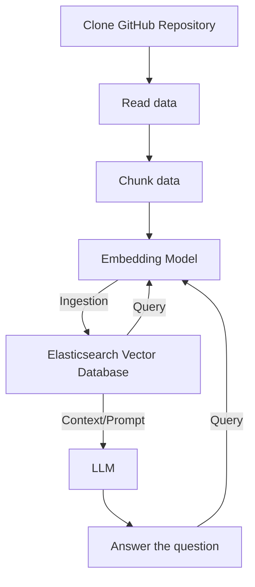

# github-repo-searcher
**DoD**: Развернуто локальное решение с простым frontend. Система должна позволять загрузить ссылку на GitHub-репозиторий, по которому в дальнейшем можно будет задавать вопросы по коду

### Схема работы


### Запуск и тестирование

Система работает как расширение vscode. Чтобы его запустить, склонируйте репозиторий и откройте его в VS Code.
Далее в терминале

```
npm install
npm run compile
```

Затем,

```
ctrl+shift+p
Debug: Start debugging
```

После этого откроется новое окно VS Code. Это окно, в котором работает расширение. В новом окне откройте git репозиторий.

```
ctrl+shift+p
Open chat
```

